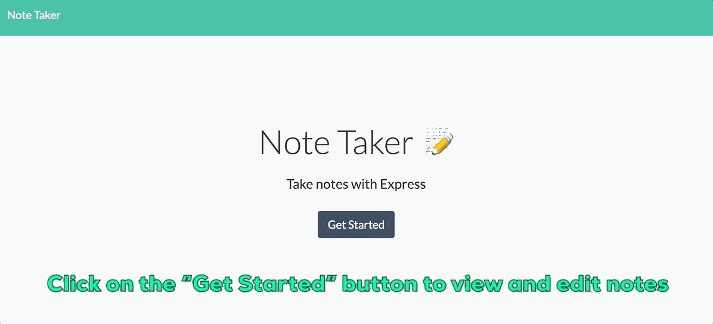
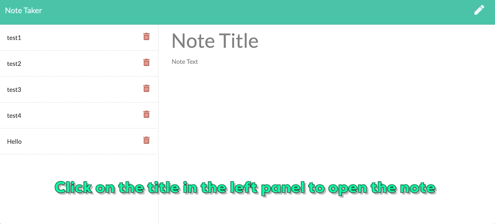
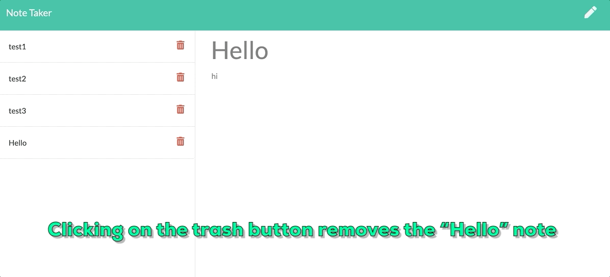

# Note Taker

An application that can be used to write, save, and delete notes. Note Taker uses an express backend and saves and retrieves data from a JSON file.

Note Taker is displayed across two pages.

Note Taker can write notes.

Note Taker can save notes.

Note Taker can delete notes.

**Credits**
Giphy Capture 4.1

**License**

Licensed under the MIT License.
